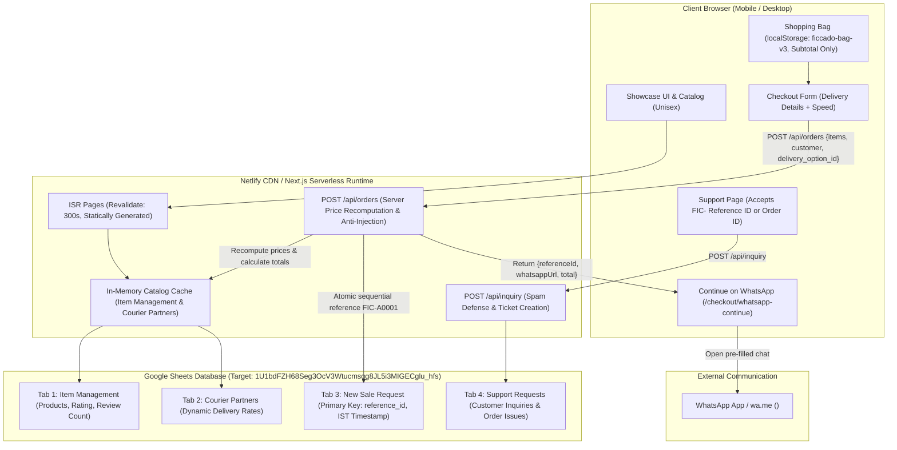
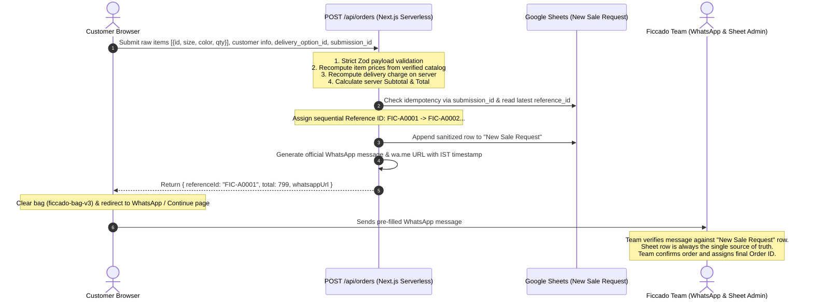

# Ficcado Storefront — Architecture, Data Backbone & Server-Verified WhatsApp Ordering (`EXPANSION.md`)

> **Single Source of Truth** for Ficcado's storefront architecture, Google Sheets database backbone, server-verified checkout, asset hierarchy, Netlify edge deployment, and WhatsApp order handoff.
> 
> *Governing Specifications*:
> - `docs/AGENT_BRIEF.md` (Initial Audit, Netlify Architecture, Performance)
> - `docs/AGENT_BRIEF_2_WHATSAPP_ORDERING_REFACTOR.md` (Unisex Catalog, Direct WhatsApp Checkout, Removal of Mock Data)
> - `docs/REFACTOR_ON_PREVIOUS_UPDATE.md` (Audit Fixes, 4-Tab Google Sheets Backbone, Server-Verified WhatsApp Orders, Reference ID Rollover)
> - Complete Evidence Report: `REFACTOR_ON_PREVIOUS_UPDATE_COMPLETED.md`

---

## 1. System Architecture Overview

The storefront is engineered with **Next.js 16.3.5 (Turbopack)**, **React 19.2.8**, and **Tailwind CSS v4** (`@tailwindcss/postcss`). It operates as a high-speed, server-verified **showcase + order-intent storefront** backed by Google Sheets as a living database.

---

## 2. Google Sheets Data Backbone (4 Required Tabs)

The application communicates directly with Google Sheets API v4 using native Node.js `crypto` with `RS256` JWT service account signing. No bulky SDKs (`googleapis`) are packaged in serverless bundles.

### 2.1 Tab Specifications
1. **`Item Management`**:
   - Primary catalog source.
   - Core required columns: `id`, `item_name`, `type`, `price`, `sizes`, `average_rating`, `review_count`.
   - UI columns: `colors`, `description`, `slug`, `in_stock`, `featured`, `active`, `sort_order`.
   - Category types strictly enforced: `T-Shirts`, `Combos`, `Shirts`, `Hoodies`, `Pants`, `Sneakers`.
2. **`Courier Partners`**:
   - Dynamic carrier pricing.
   - Columns: `partner_id`, `partner_name`, `partner_phone`, `partner_address`, `rate_per_delivery`, `created_at`, `updated_at`, `status`.
   - If rates are identical across active partners, that rate is applied. Fallback default: ₹100.
3. **`New Sale Request`**:
   - Order intent database; `reference_id` serves as primary key.
   - Columns: `reference_id`, `created_at`, `status`, `final_order_id`, `customer_name`, `customer_email`, `customer_phone`, `address_line1`, `address_line2`, `city`, `state`, `pincode`, `landmark`, `delivery_option`, `delivery_charge`, `subtotal`, `total_amount`, `item_count`, `items_summary`, `items_json`, `submission_id`.
   - Anti-formula injection: Every cell starting with `=`, `+`, `-`, or `@` is prefixed with `'`.
   - Duplicate prevention: Client sends unique `submission_id`. The server checks existing rows before appending to guarantee idempotency.
4. **`Support Requests`**:
   - Ticket inbox for contact and order support requests.
   - Columns: `id`, `created_at`, `name`, `email`, `phone`, `type`, `subject`, `message`, `order_id`, `status`.

---

## 3. Delivery Configuration & Pricing

| Option (Display Name) | Delivery Time | Charge | Source |
|-----------------------|---------------|--------|--------|
| **Indian Post (Speed Post)** | 3–4 days | **₹0 (Free)** | `src/config/delivery.ts` (Default) |
| **DTDC** | 2–3 days | **₹50** | `src/config/delivery.ts` |
| **Courier Partners** | 1–2 days | **₹100** | `Courier Partners` sheet tab (fallback ₹100) |

*Rules*:
- In the Bag drawer/modal: **Zero shipping lines are displayed**. The bag displays **Subtotal only**.
- Delivery charges are presented only on the Checkout page when the customer selects a speed.
- The server recomputes the delivery charge during `POST /api/orders`; client prices are display-only.

---

## 4. Server-Verified WhatsApp Ordering Flow

### 4.1 Tamper Protection Guarantees
- **Client DevTools Tampering**: Prices stored in `localStorage` or modified in DOM are completely ignored by the server.
- **WhatsApp Compose-Box Tampering**: If a customer modifies prices or items in WhatsApp, the Ficcado fulfillment team compares the message against the server-generated `New Sale Request` row. The sheet row always wins.
- **Offline Fallback**: If Google Sheets is temporarily unreachable, an offline reference ID (`FIC-T...`) is generated and the message includes: `⚠️ Note: Order could not be pre-saved; team to verify manually.`

---

## 5. Reference ID Rollover System

Reference IDs follow the sequential format: `FIC-` + `Letters` + `4-digit number`:
- `FIC-A0001` through `FIC-A9999`
- Rollover to `FIC-B0001` through `FIC-B9999`
- After `FIC-Z9999`, rolls over to `FIC-AA0001` (spreadsheet column progression)
- Configurable limit via `ORDER_ID_LIMIT` (default 9999)
- All customer touchpoints clearly label it: **"Reference ID (temporary)"**.

---

## 6. Support Page Lookup

The Support page accepts:
1. **Reference IDs**: `^FIC-[A-Z]+\d{4,}$` or `^FIC-T[A-Z0-9]+$`
2. **Team Final Order IDs**: `^[A-Za-z0-9][A-Za-z0-9-]{3,29}$`
3. Legacy `FKD-` format is completely eliminated.
4. Security: The site never leaks customer or order details over public lookup.

---

## 7. Operational Guidelines for Ficcado Admin Team

1. **Verify Orders Against Sheets**: Never fulfill an order based solely on WhatsApp text. Always confirm the row in `New Sale Request` matches the `reference_id` and item totals.
2. **Assigning Final Order IDs**: Once payment/confirmation is received, enter the team's official tracking/order ID in column D (`final_order_id`) and update column C (`status`) from `NEW` to `CONFIRMED`.
3. **Never Delete Rows**: If an order is cancelled, set column C (`status`) to `CANCELLED`. Deleting rows disrupts sequence tracking.
4. **Updating Catalog**:
   - Add new items in `Item Management`.
   - Update `average_rating` and `review_count` directly in the sheet; changes propagate automatically within the revalidation window.

---

## 8. Deployment & Environment Variables

| Variable | Description |
|----------|-------------|
| `GOOGLE_SHEET_ID` | Spreadsheet ID (`1U1bdFZH68Seg3OcV3Wtucmsqg8JL5i3MIGECglu_hfs`) |
| `GOOGLE_SERVICE_ACCOUNT_EMAIL` | Service Account Email (`ficcado-quick-webapp@ficcado-quick-website.iam.gserviceaccount.com`) |
| `GOOGLE_PRIVATE_KEY` | RSA private key from credentials JSON |
| `GOOGLE_SERVICE_ACCOUNT_KEY_FILE` | Optional local file path for dev/CLI |
| `NEXT_PUBLIC_WHATSAPP_NUMBER` | Target WhatsApp line (`919497144795`) |
| `NEXT_PUBLIC_SITE_URL` | Canonical production URL (`https://ficcado.store`) |
| `ORDER_ID_LIMIT` | Rollover threshold per series (default `9999`) |
| `SEED_SAMPLE_DATA` | Set `false` to avoid seeding sample products |
| `SHEETS_STRICT` | Set `true` to fail builds if Google Sheets connection fails |

*Note*: Any change to `NEXT_PUBLIC_*` variables requires a redeploy since they are inlined at build time.
