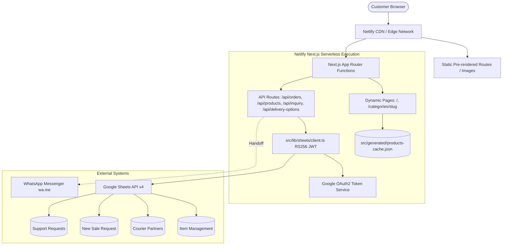
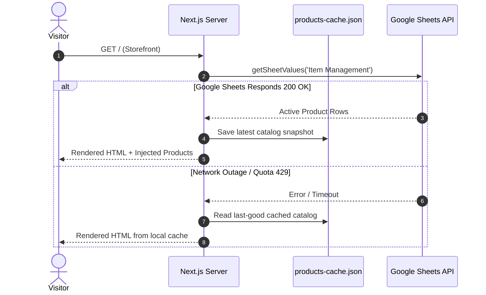
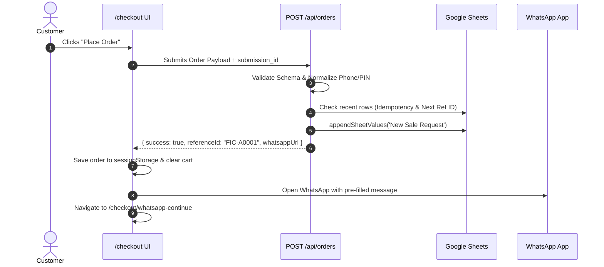

# Architecture & System Design — Ficcado

**Purpose:** Comprehensive architectural overview, component topology, request lifecycle, data flow diagrams, caching strategies, and operational runbooks.  
**Last Updated:** 2026-10-06  
**Audited Commit:** `90c3da4b63cec8406526a6e91f28e9de0a867def`  
**Source:** `Ficcado-Website.md` + repository codebase  

---

## 1. System Overview

Ficcado is built on Next.js 16 (App Router) deployed to Netlify with Google Sheets serving as the dynamic datastore. It eliminates SQL database hosting overhead while providing an immediately editable administrative spreadsheet interface for inventory, pricing, courier partner rates, and order tracking.

---

## 2. Request & Data Flows

### 2.1 Catalog Read Path
1. Visitor requests `/` or `/categories/[slug]`.
2. Server function executes `getProducts()`.
3. System calls `getSheetValues()` for `'Item Management'!A1:Z100`.
4. Response headers and active rows are parsed dynamically by column header names.
5. Parsed product models are cached locally to `src/generated/products-cache.json`.
6. HTML is rendered with server-injected JSON-LD schemas and returned to the client.
7. **Fallback:** If Google Sheets API fails or throttles, the server reads from `products-cache.json`.

### 2.2 Order Write Path (Checkout & WhatsApp Handoff)
1. Customer submits shipping and bag payload via `POST /api/orders`.
2. Zod validates payload shape, mobile number normalization, and PIN code.
3. Server re-fetches catalog and selected courier partner; recalculates subtotal and delivery charge on the server.
4. Server queries recent rows of `'New Sale Request'`:
   - Enforces idempotency via `submission_id`.
   - Computes next sequential Reference ID (`FIC-A0001` ... `FIC-Z9999` → `FIC-AA0001`).
5. Server executes `sanitizeCell()` across all fields to neutralize spreadsheet formula injections.
6. Server appends row with an 8-second timeout guard.
7. Server builds formatted WhatsApp message with encoded item URLs and returns response with `whatsappUrl`.
8. Client receives response, saves order summary in `sessionStorage`, launches `wa.me` in a new window, and transitions to `/checkout/whatsapp-continue`.

---

## 3. Google Sheets Calls Per Request & Quota Budget (B-02)

| Journey / Path | Sheets Calls (Current) | Sheets Calls (Post-Fix Target) | Quota Impact & Capacity |
|---|---|---|---|
| **Visitor Page View (`/` or `/categories/[slug]`)** | 1 read call (`Item Management`) | **0 calls** (Served via ISR edge cache, `revalidate = 60`) | At 100k visitors: 0 calls to Google Sheets in steady state. |
| **Checkout Page Load (`/checkout`)** | 1 read call (`Courier Partners` via `/api/delivery-options`) | **0 calls** (Served via shared cache with `s-maxage`) | Eliminates quota burn on checkout page loads. |
| **Order Placement (`POST /api/orders`)** | **4–5 calls** (Catalog read + Courier read + Schema cold check + Recent rows read + Row append) | **1 call** (Catalog & Courier from shared cache + 1 atomic create/append call) | **Current limit:** Max ~12–15 orders/min before hitting Google's 60 req/min limit. **Target:** 60 orders/min. |
| **Support Ticket (`POST /api/inquiry`)** | 1 write call (`Support Requests` append) | 1 write call (Honeypot guarded + rate limited) | Up to 60 tickets/min per quota limit. |

**Official Quota Documentation:**  
Google Sheets API v4 limits are **60 read requests per minute per user** and **60 write requests per minute per user** ([Google Sheets API Usage Limits](https://developers.google.com/sheets/api/limits)).

---

## 4. Caching Architecture & TTLs

| Resource | Cache Layer | TTL / Strategy | Purpose |
|---|---|---|---|
| `/_next/static/*` | Netlify CDN / Browser | `max-age=31536000, immutable` | Permanent caching for hashed static build chunks |
| `/images/*` | Netlify CDN / Browser | `max-age=86400, stale-while-revalidate=604800` | 1-day edge cache with 7-day background refresh |
| `/fonts/*` | Netlify CDN / Browser | `max-age=31536000, immutable` | Permanent font asset caching |
| Product Catalog Cache | Node.js Memory & Snapshot | Shared cached object + build-time snapshot | Fallback cache during Google API downtime |
| Google OAuth2 Bearer Token | In-Memory Object | 3600s with 300s margin | Reuses access token across serverless requests |

---

## 5. Architecture Decision Records (ADRs)

### ADR-001: Google Sheets as Serverless Administrative Database
- **Status:** Accepted
- **Context:** The team needed a collaborative, zero-cost, immediately editable spreadsheet interface to manage prices, inventory statuses, and incoming sales inquiries without building a custom database admin panel.
- **Decision:** Use Google Sheets API v4 via service account authentication. Implement dynamic column resolution, strict input sanitization, sequential ID generation, and local cache fallbacks.

### ADR-002: WhatsApp Assisted Checkout Handoff
- **Status:** Accepted
- **Context:** Automated payment gateway transaction fees and drop-off rates on high-friction payment gateways.
- **Decision:** Server calculates final totals and logs orders, but defers final payment collection and custom sizing confirmation to direct WhatsApp chat with the Ficcado operations team.

### ADR-003: Pure Node.js RS256 JWT Authentication (No Google Auth Library)
- **Status:** Accepted
- **Context:** Official Google client libraries introduce heavy dependency trees and increase serverless cold start times.
- **Decision:** Implement token exchange using Node's built-in `crypto.createSign('RSA-SHA256')`.

---

## 6. Operational Runbooks

### 6.1 Rotating Google Service Account Keys
1. In Google Cloud Console: IAM & Admin → Service Accounts → generate new JSON key.
2. In Netlify Site Settings: update `GOOGLE_SERVICE_ACCOUNT_EMAIL` and `GOOGLE_PRIVATE_KEY` with new credentials.
3. Delete previous key in Google Cloud Console.

### 6.2 Traffic Spikes & 429 Handling
1. With ISR enabled, public traffic is absorbed by Netlify CDN.
2. Order writes automatically engage offline reference IDs (`FIC-T...`) if Google Sheets operations exceed 8 seconds.

### 6.3 Updating Public WhatsApp Business Number
1. Update `NEXT_PUBLIC_WHATSAPP_NUMBER` in Netlify Environment Variables.
2. Trigger production rebuild (as `NEXT_PUBLIC_*` values are embedded into client JavaScript at build time).
